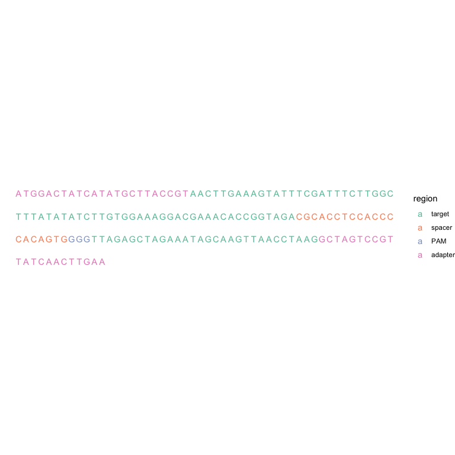
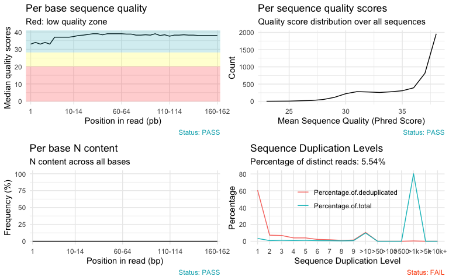
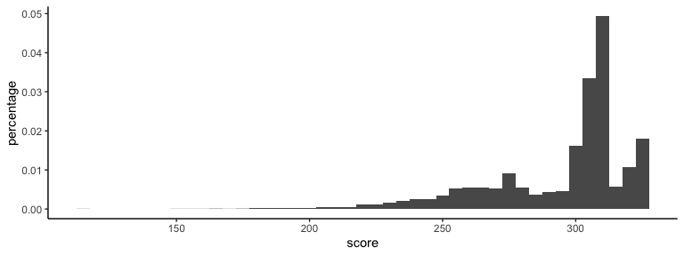
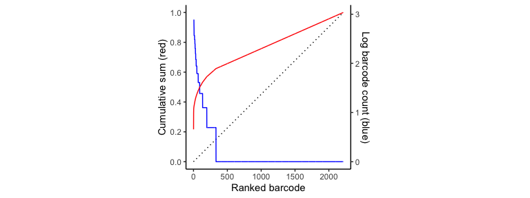
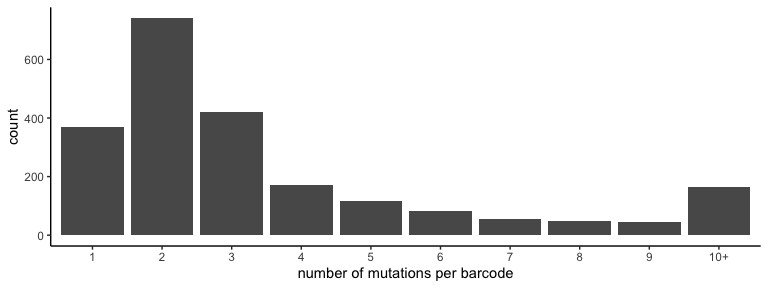
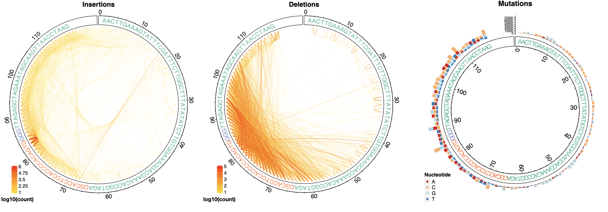
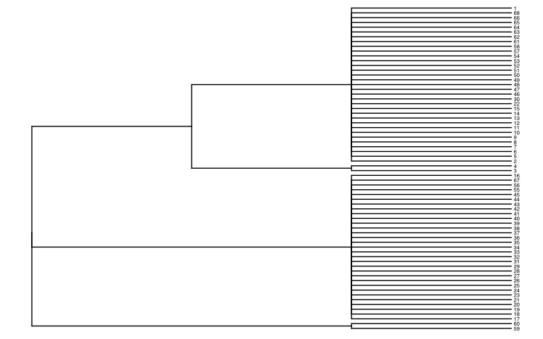
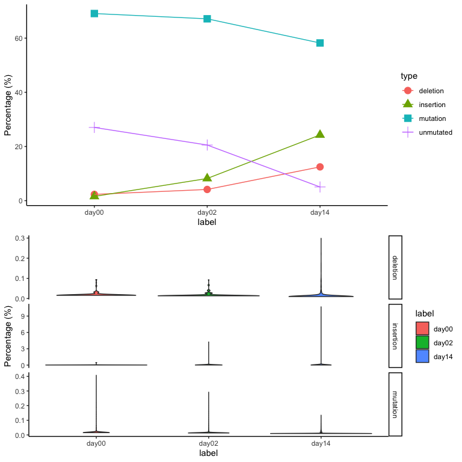

Supplementary Figures
=====================


Supplementary Methods
=====================

Input files to TraceQC R package
--------------------------------

A FASTQ file and a reference file are required to use TraceQC. The
reference is a text file which contains information as follows:

    ATGGACTATCATATGCTTACCGTAACTTGAAAGTATTTCGATTTCTTGGCTTTAT...ACTTGAA
    target 23 140
    spacer 87 107
    PAM 107 110

The first line of the reference file represents a construct sequence.
The following lines indicate the target, the spacer, and the PAM regions
of the construct. The numbers next to each region name numbers specify
the start and end locations of the region. Be aware that locations are
noted as 0-based indices.

Main steps in TraceQC
---------------------

### Aligning sequence reads to the reference sequence

To align the target sequence with construct reference sequence, TraceQC
uses global alignment with affine penalty as implemented in Biopython
(Cock et al. 2009). The default match score, mismatch score, gap opening
penalty and gap extension penalty is set to 2,  − 2,  − 6 and  − 0.1
respectively. The motivation of choosing a small gap extension penalty
is due to the high proportion of indels in CRISPR induced mutations.
After the alignment, the adapter regions are trimmed off and the
evolving barcode regions are preserved and used to identify mutation
events. Sequence-level parallelization using the `multiprocessing`
library is applied to speed up the alignment process. The
parallelization makes the process about 10 times faster when 16 cores
are used.

### Identification of mutation events

CRISPR induced mutations show great diversity of indels in terms of
length and position (Chen et al. 2019). For each sequence read, TraceQC
locates every mutation and extracts the follwoing: the mutation type
(point mutation, deletion, or insertion), the mutation start position on
the reference sequence, the mutation length, and the mutation altered
sequence (Supplementary Figure S1-B).

### Construction of Boolean sequence

In this step, TraceQC aggregates all the sequence reads and identifies
*n* unique mutation events
\[*m*<sub>1</sub>, *m*<sub>2</sub>…*m*<sub>*n*</sub>\]. TraceQC then
converts each sequence read into a boolean sequence
*B* = \[*b*<sub>1</sub>, *b*<sub>2</sub>…*b*<sub>*n*</sub>\] in which
*b*<sub>*i*</sub> = *T**R**U**E* means the sequence contains mutation
event *m*<sub>*i*</sub>. This Boolean sequence can be directly applied
to reconstruct the cell lineage tree.

Generating the TraceQC report
-----------------------------

In TraceQC package, the `generate_qc_report` function is used to create
a QC report. The following script shows how to generate a QC report
using the function.

``` r
library(TraceQC)
obj <- generate_qc_report(
  input_file = system.file("extdata", "test_data",
                           "fastq", "example.fastq", package="TraceQC"),
  ref_file = system.file("extdata", "test_data",
                         "ref", "ref.txt", package="TraceQC"),
  preview = FALSE,
  title = "TraceQC report",
  ncores=1
  )
summary(obj)
```

Once the function has been executed successfully, a report as shown
below will be generated. In the example below, we used a sample from
(Kalhor, Mali, and Church 2017).

### TraceQC report

date: 2020-06-04

### Input files to generate the report

-   Input file: `example.fastq`
-   Construct file: `ref.txt`

### Construct structure



### Basic Statistics of the sample file

### Sequence quality control



### Alignment score distribution



### Barcode distribution inequality



### Most frequent mutation patterns

### Number of mutations per barcode



### Summary of mutation events


### Mutation hotspot plots



Generating a TraceQC object
---------------------------

When users want to use plot functions in TraceQC, it is required to
create a TraceQC object for a given sample. This section shows how to
create the object.

First,the `TraceQC` package needs to be imported. The package is
available at
<a href="https://github.com/LiuzLab/TraceQC" class="uri">https://github.com/LiuzLab/TraceQC</a>.
If there is no FastQC report, it is recommended to import `fastqcr`
package to create a FastQC report for the sample.

``` r
library(TraceQC)
library(fastqcr)
```

To create a TraceQC object, three different files are required.

-   `input_file`: A FASTQ file from an experiment of linage tracing
    experiment using CRISPR.

``` r
input_file <- system.file("extdata", "test_data",
                          "fastq", "example_small.fastq", package="TraceQC")
cat(readLines(input_file)[1:4], sep = "\n")
```

-   `ref_file`: A text file that contains a construct (for reference)
    sequence.

``` r
ref_file <- system.file("extdata", "test_data", "ref",
                        "ref.txt", package="TraceQC")
cat(readLines(ref_file), sep = "\n")
```

-   `input_qc_path`: A path to the
    [FastQC](https://www.bioinformatics.babraham.ac.uk/projects/fastqc/)
    file which corresponds to `input_file`. It is possible to import the
    FastQC file from outside the workspace, but if no FastQC file has
    been generated yet, then it is possible to create it using the
    `fastqcr` package. The package can be installed by using
    `install_external_packages`. To generate a FastQC file and get the
    path, the following lines are needed.

``` r
qc_dir <- tempdir() # It is possible to set the dir to another location.

# The first argument is a directory, not a path, 
# so if there are multiple FASTQ files in a directory, it doesn't have to run
# `fastqc` function multiple times.
fastqc(system.file("extdata", "test_data",
                   "fastq", package = "TraceQC"), 
       qc.dir=qc_dir)
# This function tell where the FastQC file which is corresponded to `input_file`.
input_qc_path <- get_qcpath(input_file, qc_dir)
```

After the required files are ready, running `TraceQC` will generate an
object.

``` r
obj <- TraceQC(input_file = input_file,
               ref_file = ref_file,
               fastqc_file = input_qc_path,
               ncores = 4)
```

Additional analysis by TraceQC
------------------------------

`TraceQC` is a versatile tool. In addtion to performing Quality Control,
it can be used for phylogenetic reconstruction and can handle time
series data.

### Phylogenetic reconstruction

The example below shows how to load an object to run a phylogenetic
reconstruction using `phangorn` and `ggtree` package.

First, we are going to load `TraceQC` package and an example object
(`example_obj`).

``` r
library(TraceQC)
library(phangorn)
library(ggtree)
data(example_obj)
```

Next, `build_character_table` in `TraceQC` will convert the object to a
list that contains a matrix and sequence information.

``` r
tree_input <- build_character_table(example_obj)
```

Finally, we can reconstruct a phylogenetic tree with the following code.

``` r
data <- phyDat(data=tree_input$character_table,type="USER",levels=c(0,1))
dm <- dist.hamming(data)
treeUPGMA <- upgma(dm)
treePars <- optim.parsimony(treeUPGMA, data)
```

    ## Final p-score 68 after  0 nni operations

``` r
ggtree(treePars) +
  geom_tiplab(size=2)
```



### Handling time series data

TraceQC provides a function to handle multiple samples for different
time points. The following R script shows how to handle multiple samples
using the `create_obj_list` function. In the example below, we use
samples of day 0, day 2, and day 14 from (Kalhor, Mali, and Church
2017).

``` r
samples <- list(
  "day00" = system.file("extdata", "test_data", "fastq",
                        "example_0d.fastq", package="TraceQC"),

  "day02" = system.file("extdata", "test_data", "fastq",
                        "example_2d.fastq", package="TraceQC"),

  "day14" = system.file("extdata", "test_data", "fastq",
                        "example_14d.fastq", package="TraceQC")
)

ref <- system.file("extdata", "test_data", "ref",
                   "ref.txt", package="TraceQC")

obj_list <- create_obj_list(samples, ref)
```

After running `create_obj_list`, `obj_list` which is a list and has
three elements is created.

``` r
summary(obj_list)
```

    ##       Length Class  Mode
    ## day00 5      -none- list
    ## day02 5      -none- list
    ## day14 5      -none- list

With `obj_list`, users can check changes of the percentage of mutations
across different time points using `plot_mutation_pattern_lineplot` or
`plot_mutation_pattern_violinplot`.

``` r
plot_grid(
  plot_mutation_pattern_lineplot(obj_list),
  plot_mutation_pattern_violinplot(obj_list), ncol=1)
```



Programming libraries
---------------------

The following programming libraries were used To implement the TraceQC
package:

Languages:

-   `R` (Team and others 2020)
-   `Python` (Van Rossum and Drake Jr 1995)

Packages:

The following `python` packages were used:

-   `biopython` (Cock et al. 2009)
-   `pandas` (McKinney and others 2011)

The following `R` packages were used:

-   `ggplot2` (Wickham 2011)
-   `circlize` (Gu et al. 2014)
-   `ComplexHeatmap` (Gu, Eils, and Schlesner 2016)  
-   `tidyverse` (Wickham et al. 2019)
-   `fastqcr` (“Fastqcr: Quality Control of Sequencing Data” 2019)
-   `rmarkdown` (Xie, Allaire, and Grolemund 2018)
-   `kableExtra` (Zhu 2018)
-   `RColorBrewer` (“RColorBrewer: ColorBrewer Palettes” 2014)
-   `reticulate` (“Reticulate: Interface to ’Python’” 2020)
-   `DECIPHER` (Wright 2020)
-   `tictoc` (“Tictoc: Functions for Timing R Scripts, as Well as
    Implementations of Stack and List Structures” 2014)

References
----------

Chen, Wei, Aaron McKenna, Jacob Schreiber, Maximilian Haeussler, Yi Yin,
Vikram Agarwal, William Stafford Noble, and Jay Shendure. 2019.
“Massively Parallel Profiling and Predictive Modeling of the Outcomes of
Crispr/Cas9-Mediated Double-Strand Break Repair.” *Nucleic Acids
Research* 47 (15): 7989–8003.

Cock, Peter JA, Tiago Antao, Jeffrey T Chang, Brad A Chapman, Cymon J
Cox, Andrew Dalke, Iddo Friedberg, et al. 2009. “Biopython: Freely
Available Python Tools for Computational Molecular Biology and
Bioinformatics.” *Bioinformatics* 25 (11): 1422–3.

“Fastqcr: Quality Control of Sequencing Data.” 2019.
<https://CRAN.R-project.org/package=fastqcr>.

Gu, Zuguang, Roland Eils, and Matthias Schlesner. 2016. “Complex
Heatmaps Reveal Patterns and Correlations in Multidimensional Genomic
Data.” *Bioinformatics* 32 (18): 2847–9.

Gu, Zuguang, Lei Gu, Roland Eils, Matthias Schlesner, and Benedikt
Brors. 2014. “Circlize Implements and Enhances Circular Visualization in
R.” *Bioinformatics* 30 (19): 2811–2.

Kalhor, Reza, Prashant Mali, and George M Church. 2017. “Rapidly
Evolving Homing Crispr Barcodes.” *Nature Methods* 14 (2): 195.

McKinney, Wes, and others. 2011. “Pandas: A Foundational Python Library
for Data Analysis and Statistics.” *Python for High Performance and
Scientific Computing* 14 (9).

“RColorBrewer: ColorBrewer Palettes.” 2014.
<https://CRAN.R-project.org/package=RColorBrewer>.

“Reticulate: Interface to ’Python’.” 2020.
<https://CRAN.R-project.org/package=reticulate>.

Team, R Core, and others. 2020. “R: A Language and Environment for
Statistical Computing.”

“Tictoc: Functions for Timing R Scripts, as Well as Implementations of
Stack and List Structures.” 2014.
<https://CRAN.R-project.org/package=tictoc>.

Van Rossum, Guido, and Fred L Drake Jr. 1995. *Python Reference Manual*.
Centrum voor Wiskunde en Informatica Amsterdam.

Wickham, Hadley. 2011. “Ggplot2.” *Wiley Interdisciplinary Reviews:
Computational Statistics* 3 (2): 180–85.

Wickham, Hadley, Mara Averick, Jennifer Bryan, Winston Chang, Lucy
McGowan, Romain François, Garrett Grolemund, et al. 2019. “Welcome to
the Tidyverse.” *Journal of Open Source Software* 4 (43): 1686.

Wright, Erik. 2020. “DECIPHER: Tools for Curating, Analyzing, and
Manipulating Biological Sequences.” Bioconductor version: Release
(3.11). <https://doi.org/10.18129/B9.bioc.DECIPHER>.

Xie, Yihui, Joseph J Allaire, and Garrett Grolemund. 2018. *R Markdown:
The Definitive Guide*. CRC Press.

Zhu, Hao. 2018. “KableExtra: Construct Complex Table with’kable’and Pipe
Syntax.” *URL Https://CRAN. R-Project. Org/Package= kableExtra, R
Package Version 0.9. 0*.
