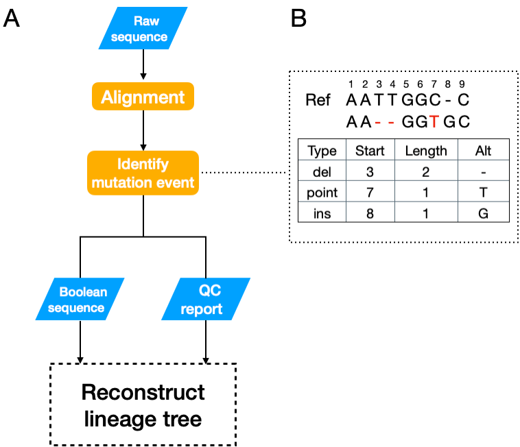

```{r setup, include=FALSE}
knitr::opts_chunk$set(echo = TRUE,
                      knitr::opts_chunk$set(fig.width=8, fig.align = "center"))
```

\newpage
\beginsupplement

# Supplementary Figures



\newpage

# Supplementary Method

## Input of TraceQC R package

A FASTQ file and a reference file are required to use TraceQC. The reference is a text file which contains information as follows:

```
ATGGACTATCATATGCTTACCGTAACTTGAAAGTATTTCGATTTCTTGGCTTTAT...ACTTGAA
target 23 140
spacer 87 107
PAM 107 110
```

The first line of the reference file represents a construct sequence. The other lines indicates target, spacer, and PAM regions of the construct. In these lines, two numbers next to a region name specify the start and end locations of the region. Be aware that locations are noted as 0-based indices.


## Alining sequence reads to the reference sequence

To align the target sequence with construct reference sequence, TraceQC uses global alignment with affine penalty implemented in Biopython[@cock2009biopython]. The default match score, mismatch score, gap opening penalty and gap extension penalty is set to $2$, $-2$, $-6$ and $-0.1$ respectively. The motivation of choosing a small gap extension penalty is due to the high proportion of indels in CRISPR induced mutations. After the alignment, the adapter regions are trimmed off and the evolving barcode regions are preserved and used to identify mutation events. A sequence-level of parallelization using `multiprocessing` library is applied to speed up the process. The parallelization makes the process about 10 times faster when 16 cores is used.


## Identification of mutation events

CRISPR induced mutations show great diversity of indels in terms of length and position[@chen2019massively]. For each sequence read, TraceQC locate every mutation and extract its mutation type (point mutation, deletion, or insertion), its starting position on the reference sequence, its length and its altered sequence (Supplementary Figure 1B). 


## Construction of Boolean sequence

In this step, TraceQC aggregated all the sequence reads and identify $n$ unique mutation events $[m_1, m_2 … m_n]$. TraceQC then convert each sequence read into a boolean sequence $B = [b_1,b_2 … b_n]$ in which $b_i = TRUE$ means the sequence contains mutation event $m_i$. 
This Boolean sequence can be directly applied to reconstruct cell lineage tree.

## Programming Libraries 

The following programming libraries were used To implement the TraceQC package:

Languages:

* `R` [@team2013r]
* `Python` [@van1995python]

Packages:

The following `python` packages were used:

* `biopython` [@cock2009biopython]
* `pandas` [@mckinney2011pandas]

The following `R` packages were used:

* `ggplot2` [@wickham2011ggplot2]
* `circlize` [@gu2014circlize]
* `ComplexHeatmap` [@gu2016complex]   
* `tidyverse` [@wickham2019welcome]
* `fastqcr` [@kassambara_fastqcr:_2019]
* `rmarkdown` [@xie2018r]
* `kableExtra` [@zhu2018kableextra]
* `RColorBrewer` [@neuwirth_rcolorbrewer:_2014]
* `reticulate` [@ushey_reticulate:_2020]
* `DECIPHER` [@wright_decipher:_2020]
* `tictoc` [@izrailev_tictoc:_2014]

\newpage

## Generating a TraceQC object in R

If users want to perform a quality check by themselves in R, it is required to create a TraceQC object for a given sample. This section section shows how to create the object.

First, it needs to import `TraceQC` package. The package is available at https://github.com/LiuzLab/TraceQC. If there is no FastQC report, it is recommended to import `fastqcr` package to create a FastQC report for the sample.

```{r eval=FALSE}
library(TraceQC)
library(fastqcr)
```


To create a TraceQC object, three different files are required.

* `input_file`: It is a FASTQ file from an experiment of linage tracing experiment using CRISPR.

```{r eval=FALSE}
input_file <- system.file("extdata", "test_data",
                          "fastq", "example_small.fastq", package="TraceQC")
cat(readLines(input_file)[1:4], sep = "\n")
```

* `ref_file`: It is a text file that contains a construct (for reference) sequence.


```{r, eval=FALSE}
ref_file <- system.file("extdata", "test_data", "ref",
                        "ref.txt", package="TraceQC")
cat(readLines(ref_file), sep = "\n")
```

* `input_qc_path`: A path to the [FastQC](https://www.bioinformatics.babraham.ac.uk/projects/fastqc/) file which is corresponded to `input_file`. It is possible to execute or bring the FastQC file outside the workspace, but if there has been no FastQC file yet, then it is possible to create it using `fastqcr` package. The package can be installed by using `install_external_packages`. To generate a FastQC file and get the path, the following lines are needed.

```{r eval=FALSE}
qc_dir <- tempdir() # It is possible to set the dir to another location.

# The first argument is a directory, not a path, 
# so if there are multiple FASTQ files in a directory, it doesn't have to run
# `fastqc` function multiple times.
fastqc(system.file("extdata", "test_data",
                   "fastq", package = "TraceQC"), 
       qc.dir=qc_dir)
# This function tell where the FastQC file which is corresponded to `input_file`.
input_qc_path <- get_qcpath(input_file, qc_dir)
```

After the required files are ready, running `TraceQC` will generate an object.

```{r eval=FALSE}
obj <- TraceQC(input_file = input_file,
               ref_file = ref_file,
               fastqc_file = input_qc_path,
               ncores = 4)
```


\newpage

## An example of TraceQC report

In TraceQC package, `generate_qc_report` is used to create a QC report. The following script shows how to generate a QC report using the function.

```{r, eval=FALSE}
library(TraceQC)
obj <- generate_qc_report(
  input_file = system.file("extdata", "test_data",
                           "fastq", "example.fastq", package="TraceQC"),
  ref_file = system.file("extdata", "test_data",
                         "ref", "ref.txt", package="TraceQC"),
  preview = FALSE,
  title = "TraceQC report",
  ncores=1
  )
summary(obj)
```

Once the function has been executed successfully, a report like below will be generated. In the example, we used a sample from [@kalhor2017rapidly].

### `r params$set_title`

date: `r params$date`

```{r echo=FALSE, message=FALSE}
library(TraceQC)
library(fastqcr)
library(tictoc)
library(knitr)
library(dplyr)
library(magrittr)
library(kableExtra)
library(cowplot)
library(stringr)
```


```{r data_loading, warning=FALSE, include=FALSE}
data(example_obj)
cur_obj <- example_obj
```

### Input files to generate the report

* Input file: `example.fastq`
* Construct file: `ref.txt`

### Construct structure

```{r construct, echo=FALSE, message=FALSE, warning=FALSE, fig.width=8, fig.height=8}
plot_construct(cur_obj)
```

### Basic Statistics of the sample file

```{r basic_stat, echo=FALSE, message=FALSE, warning=FALSE}
qc_plot(cur_obj$qc, "Basic statistics") %>% kable
```


### Sequence quality control 


```{r echo=FALSE, message=FALSE, warning=FALSE, fig.width=8}
cowplot::plot_grid(
  qc_plot(cur_obj$qc, "Per base sequence quality"),
  qc_plot(cur_obj$qc, "Per sequence quality scores"),
  qc_plot(cur_obj$qc, "Per base N content"),
  qc_plot(cur_obj$qc, "Sequence Duplication Levels"),
  ncol = 2
  )
```

### Alignment score distribution

```{r align_score, echo=FALSE, message=FALSE, warning=FALSE, fig.height=3}
plot_score_distribution(cur_obj)
```

### Barcode distribution inequality

```{r inequality, echo=FALSE, message=FALSE, warning=FALSE, fig.height=3}
lorenz_curve(cur_obj)
```

### Most frequent mutation patterns

```{r patterns, echo=FALSE, message=FALSE, warning=FALSE}
cur_obj$mutation %>% arrange(by=-count) %>% head(10) %>% 
  mutate(target_seq = str_c("...", str_sub(target_seq, 50, 80), "...")) %>% kable
```

### Number of mutations per barcode

```{r mutation_barplot, echo=FALSE, message=FALSE, warning=FALSE, fig.height=3}
num_mutation_histogram(cur_obj)
```

### Summary of mutation events

```{r mutation_summary, echo=FALSE, message=FALSE, warning=FALSE, fig.height=3}
mutation_type(cur_obj)
```

### Mutation hotspot plots 


\newpage

## Running phylogenetic reconstruction using TraceQC


`TraceQC` is a versatile tool. It is not only for performing Quality Control but also for running analysis. The example shows how to load the object to run a phylogenetic reconstruction using `phangorn` and `ggtree` package.

First, we are going to load `TraceQC` package and an example object (`example_obj`).

```{r, message=FALSE, warning=FALSE}
library(TraceQC)
library(phangorn)
library(ggtree)
data(example_obj)
```

Next, `build_character_table` in `TraceQC` will convert the object to a list that contains a matrix and sequence information.

```{r, message=FALSE, warning=FALSE, cache=TRUE}
tree_input <- build_character_table(example_obj)
```


Finally, we can reconstruct a phylogenetic tree with the following code.

``` {r figure.width=8, message=FALSE, warning=FALSE, cache=TRUE}
data <- phyDat(data=tree_input$character_table,type="USER",levels=c(0,1))
dm <- dist.hamming(data)
treeUPGMA <- upgma(dm)
treePars <- optim.parsimony(treeUPGMA, data)

ggtree(treePars) +
  geom_tiplab(size=2)
````

\newpage

## Handling Time Series Data

TraceQC provides a function to handle multiple samples for different time points.
The following R script shows how to handle multiple samples using `create_obj_list`. In the example, we use samples of day 0, day 2, and day 14 from [@kalhor2017rapidly].

```{r, eval=FALSE}
samples <- list(
  "day00" = system.file("extdata", "test_data", "fastq",
                        "example_0d.fastq", package="TraceQC"),

  "day02" = system.file("extdata", "test_data", "fastq",
                        "example_2d.fastq", package="TraceQC"),

  "day14" = system.file("extdata", "test_data", "fastq",
                        "example_14d.fastq", package="TraceQC")
)

ref <- system.file("extdata", "test_data", "ref",
                   "ref.txt", package="TraceQC")

obj_list <- create_obj_list(samples, ref)
```

```{r, include=FALSE}
data("example_obj_list")
obj_list <- example_obj_list
```

After running `create_obj_list`, `obj_list` which is a list and has three elements is created.

```{r}
summary(obj_list)
```

\newpage 

With `obj_list`, users can check changes of the percentage of mutations across different time points using `plot_mutation_pattern_lineplot` or `plot_mutation_pattern_violinplot`.
```{r, fig.width=8, fig.height=8}
plot_grid(
  plot_mutation_pattern_lineplot(obj_list),
  plot_mutation_pattern_violinplot(obj_list), ncol=1)
```

\newpage

## References